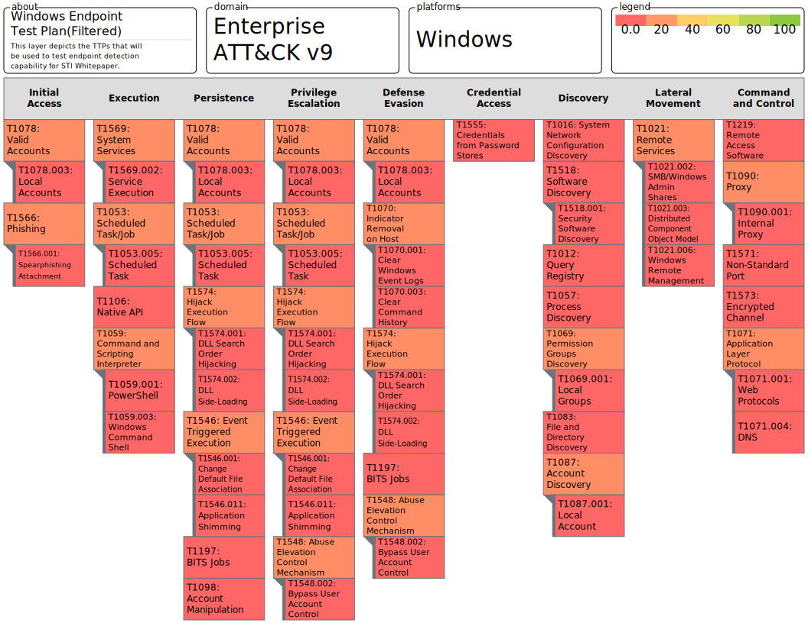

# STI-ISE5901
STI ISE 5901 Whitepaper repository

## AtomicRedTeam Test Plan in MITRE ATT&CK Navigator

- The AtomicRedTeam Test Plan is stored in json format for Navigator 4.x or 3.x.  
- Import the Windows_Endpoint_Test_Plan_4.0.json into MITRE ATT&CK Navigator 4.x (https://mitre-attack.github.io/attack-navigator/) to see test plan with sub-techniques.
- Import the Windows_Endpoint_Test_Plan_3.0.json into the MITRE ATT&CK Navigator 3.x in Security Onion 2.3.x to see the test plan without sub-techniques.

- **50** techniques and sub-techniques selected in 9 of the 12 MITRE ATT&CK Enterprise Tactics
1. https://jqplay.org/
2. Paste contents Windows_Endpoint_Test_Plan_4.0.json into JSON window.
3. Copy the following text into the Filter field: \
`.techniques[] | {techniqueID: .techniqueID, comment: .comment} | .techniqueID`
4. Copy and Paste Output into techniques.txt
5. PowerShell command to sort, unique, and count \
`get-content techniques.txt | sort-object | get-unique | measure-object -word`

- **34** Unique techniques will be tested (Duplications removed) \
1. https://jqplay.org/
2. Paste contents Windows_Endpoint_Test_Plan_4.0.json into JSON window.
3. Copy the following text into the Filter field: \
`.techniques[] | {techniqueID: .techniqueID, comment: .comment} | select(.comment!="") | .techniqueID`
4. Copy and Paste Output into techniqueID.txt
5. PowerShell command to sort, unique, and count \
`get-content techniqueID.txt | sort-object | get-unique | measure-object -word`

- **71** Atomic Red Team tests planned
1. https://jqplay.org/
2. Paste contents Windows_Endpoint_Test_Plan_4.0.json into JSON window.
3. Copy the following text into the Filter field: \
`.techniques[] | {techniqueID: .techniqueID, comment: .comment} | select(.comment!="") | .comment`
4. Copy and Paste Output into comments.txt
5. PowerShell command to sort, unique, and count \
`(get-content comments.txt).split("|") | select-string "Atomic Test #" | sort-object | measure-object -line`

## Install Invoke-AtomicRedTeam Setup
Follow instructions at https://github.com/redcanaryco/invoke-atomicredteam/wiki

For this research paper, the following setup commands were used.
1. Make a Tools Directory: `New-Item -Path"c:\" -Name "Tools" -ItemType "directory"`
2. Install Invoke-AtomicRedTeam Module:
`IEX (IWR 'https://raw.githubusercontent.com/redcanaryco/invoke-atomicredteam/master/install-atomicredteam.ps1' -UseBasicParsing); \
Install-AtomicRedTeam -InstallPath "c:\Tools" -getAtomics`
3. Update PowerShell profile to automatically install the module in new shell:
1. `notepad $profile`
2. Paste the following, save, then close. 
`Import-Module "C:\Tools\invoke-atomicredteam\Invoke-AtomicRedTeam.psd1" -Force \
$PSDefaultParameterValues = @{"Invoke-AtomicTest:PathToAtomicsFolder"="C:\Tools\atomics"}`

## Invoke-AtomicRedTeam Tests
Execute command	`Invoke-AtomicRedTeam TECHNIQUE_ID -TestNumbers TEST_NUMBERS` \
[Test Examples](https://github.com/lock-wire/STI-ISE5901/blob/main/AtomicRedTeam_Test_Plan/AtomicRedTeam_Test_Commands.md)

-How I made the test command list from Test Plan
1. https://jqplay.org/
2. Paste contents Windows_Endpoint_Test_Plan_4.0.json into JSON window.
3. Copy the following text into the Filter field: \
`.techniques[] | {techniqueID: .techniqueID, tactic: .tactic, comment: .comment} | select(.comment!="")`
4. Copy and Paste Output into techniqueID.txt
5. PowerShell command to sort, unique, and count \
`(((((gc .\command_list.txt | sort-object | get-unique).split("|")).TrimEnd("\n")).TrimStart('{"').TrimEnd('"}')).TrimEnd('"comment":')).split(",") | out-file AtomicRedTeam_Test_Commands.md`
6. The rest is good old fashion manual text editing