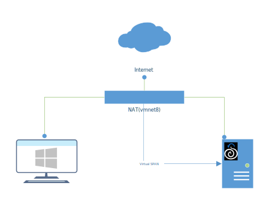

# Gap Analysis Test Environment Configuration

## Windows Endpoint
- Virtualized in VMWare
- Virtual Resources assigned: \
-- 2 vCPU \
-- 2 GB RAM \
-- 60 GB Storage Disk \
-- 1 NIC
- Operating System : Windows 10 Home 20H2
- Installed Sysmon \
--https://github.com/lock-wire/Install-Sysmon \
--From a console with admin priviledges run `./Install-Sysmon`
- Took Snapshot #1

## Security Onion 2.3.x
- Virtualized in VMWare
- Virtual Resources assigned: \
-- 4 vCPU \
-- 16 GB RAM \
-- 200 GB Storage Disk \
-- 2 NICs \
-- Hardware resource reference:  https://docs.securityonion.net/en/2.3/hardware.html#standalone-deployments
- Operating System : Security Onion 2.3.40 (CentOS) \
-- Download Security Onion image from https://securityonion.net/download
- Installation Options Selected: \
-- Management Interface: ens33 with static IP assigned in vnmet8(NAT) ip space. \
-- Monitor Interface: ens34 \
-- Deployment Mode: Standalone \
-- NIDS: Basic Setup for Suricata with ET Open ruleset \
-- Packet Metadata: Basic Setup for Zeek \
-- Search Node: Basic Setup for Elastic
- Modify Firewall rules for analyst access \
-- `sudo so-allow` | select 'a' for analyst ports (80 and 443) | enter ip or network for access (example 192.168.1.101/32 or 192.168.1.0/24)
- Added additional Yara rule repository \
-- from bash \
-- `sudo vi /opt/so/saltstack/local/pillar/global.sls` \
-- `sudo so-yara-update` 
- Update Sigma Rules in Playbook \
-- `sudo so-playbook-ruleupdate`

## Virtual Network
- Use default NAT vmnet (vmnet8) in VMWare
- All three NICs connected to same vmnet