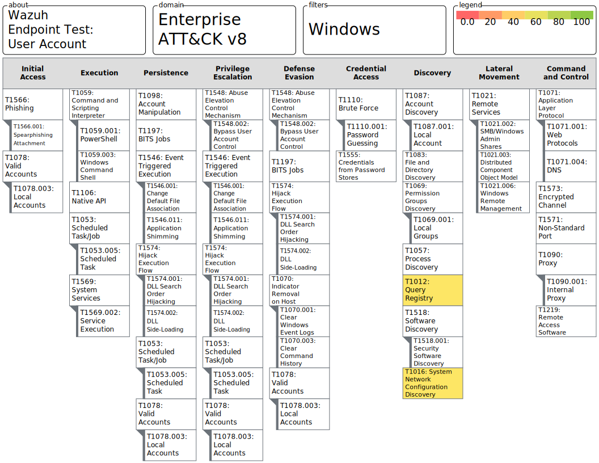

# Wazuh Endpoint Test
Wazuh 3.13.x, integrated with Security Onion 2.3.x, tested against the defined test plan.  

## Detection Measurements
Dections are scored on a scale of 0 to 100.

| Score  | Measurement     | Color |
| ------ |:---------------:| -----:|
| 0      | No Alert or Log |  `Red  ` |
| 50     | Log and No Alert|  `Amber` |
| 100    | Log and Alert   |  `Green` |

## Wazuh Endpoint Test: User Account
