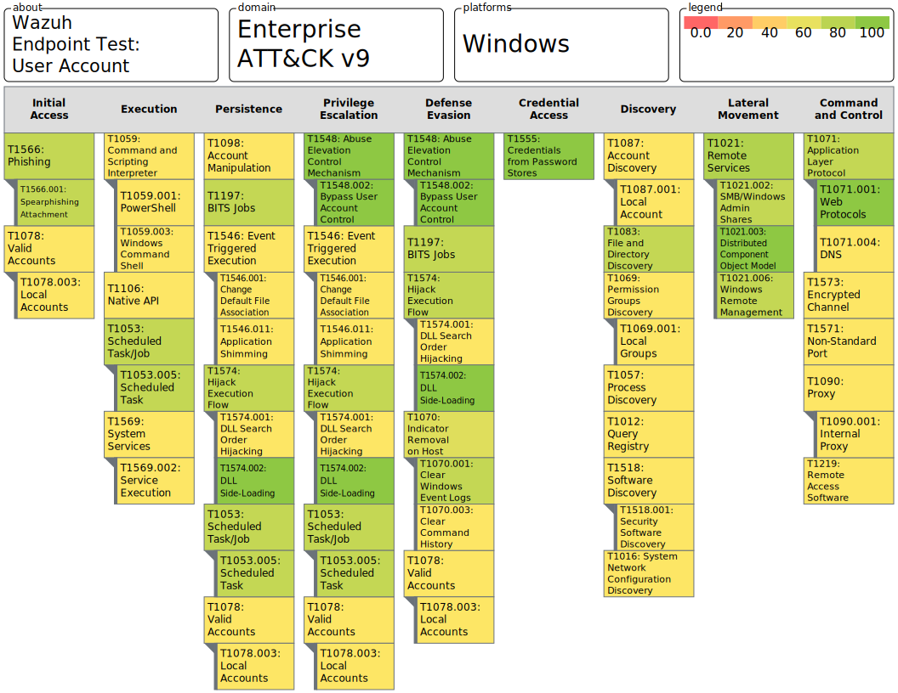

# Wazuh Endpoint Test
Wazuh 3.13.x, integrated with Security Onion 2.3.x, tested against the defined test plan.  

## Detection Measurements
Dections are scored on a scale of 0 to 100.

| Score  | Measurement     | Color |
| ------ |:---------------:| -----:|
| 0      | No Alert or Log |  `Red  ` |
| 50     | Log and No Alert|  `Amber` |
| 100    | Log and Alert   |  `Green` |

**Note:** For techniques with multiple tests, the final technique score will the sum of the scores for each test divided by the number of tests.
**Example:** Test 1 = 50 and Test 2 = 0 `(50+0)/2 = 25`

## Wazuh Endpoint Test: User Account
The Wazuh detection score is 61.36% under user privileges.

## Wazuh Endpoint Test: User Account with Detection Engineering
The Wazuh detection score with Sigma Rules enabled is 100% under user privileges.
This is a 37.12% improvement!

##Test Score Calculations

| Technique | Wazuh  | Wazuh + Detections |
| --------- | ------ | ------------------ |
| T1012     | 50     | 100                |
| T1016     | 50     | 100                |
| T1021.002 | 75     | 100                |
| T1021.003 | 100    | 100                |
| T1021.006 | 75     | 100                |
| T1053.005 | 75     | 100                |
| T1057     | 50     | 100                |
| T1059.001 | 50     | 100                |
| T1059.003 | 50     | 100                |
| T1069.001 | 50     | 100                |
| T1070.001 | 75     | 100                |
| T1070.003 | 50     | 100                |
| T1071.001 | 50     | 100                |
| T1071.004 | 100    | 100                |
| T1078.003 | 50     | 100                |
| T1083     | 75     | 100                |
| T1087.001 | 50     | 100                |
| T1090.001 | 50     | 100                |
| T1098     | 50     | 100                |
| T1106     | 50     | 100                |
| T1197     | 75     | 100                |
| T1219     | 50     | 100                |
| T1518.001 | 50     | 100                |
| T1546.001 | 50     | 100                |
| T1546.011 | 50     | 100                |
| T1548.002 | 100    | 100                |
| T1555     | 100    | 100                |
| T1566.001 | 75     | 100                |
| T1569.002 | 50     | 100                |
| T1571     | 50     | 100                |
| T1573     | 50     | 100                |
| T1574.001 | 50     | 100                |
| T1574.002 | 100    | 100                |
|           | 2075   | 3300               |
|           | 62.88% | 100.00%            |